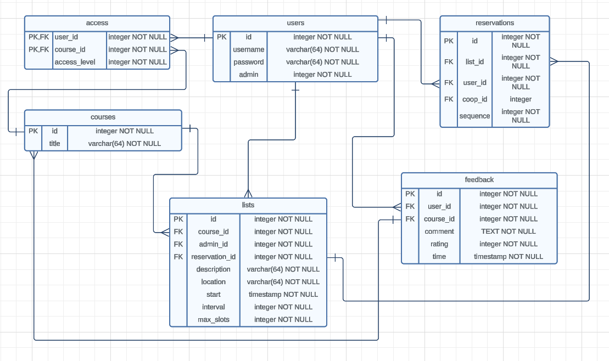

# Booking System

## Structure Diagram

bookingsystem/
your-app-name/
├── .next/                   # Auto-generated build directory by Next.js.
├── node_modules/            # Contains all the node modules that your project depends on.
├── public/                  # Static assets like images, icons, and any public resources.
│   ├── favicon.ico
│   ├── next.svg
│   ├── vercel.svg
│   └── ...
├── src/
│   ├── components/          # Reusable React components (the 'View' in MVP).
│   ├── models/              # 'Model' in MVP, contains business logic and state management.
│   ├── presenters/          # 'Presenter' in MVP, acts as an intermediary between View and Model.
│   └── dao/                 # Data Access Object layer for abstracting and encapsulating all access to the data source.
├── pages/                   # Special directory for Next.js pages and routing.
├── .eslintrc.json           # ESLint configuration for code linting.
├── .gitignore               # Specifies files to be ignored by version control.
├── jsconfig.json            # Configures project settings for Visual Studio Code.
├── next.config.js           # Customizable configuration settings for Next.js.
├── package-lock.json        # Auto-generated file to keep track of exact versions of installed npm packages.
├── package.json             # Project metadata and dependencies listed.
├── postcss.config.js        # Configuration for PostCSS processing of CSS.
├── README.md                # Project documentation and description.
└── tailwind.config.js       # Configuration for the Tailwind CSS framework.

## ERD

## Functionality Overview:

### User Roles:
- **Log In**: Mandatory for making a booking.
- **Create Booking**: Possible only at available presentation times.
- **View Own Bookings**: Users cannot see others' bookings.
- **Delete Own Bookings**: Users cannot delete others' bookings.
- **Log Out**: Users can log out of the system.

### Admin Roles:
- **Create Presentation Schedules**: Admins can create schedules for presentations.
- **View Presentation Schedules**: Admins can view lists of scheduled presentations.
- **Delete Presentation Schedules**: Admins have the ability to delete presentation schedules.

### Additional Features for Pair Programming:
- **User Access Rights**: Users should only have rights to courses as determined by the admin, therefore a table linking `course_id` and `user_id` is required for access control.
- **User Creation**: Only admins can create new user accounts.
- **Admin Booking Management**: Admins can add bookings for other users and also have the ability to delete bookings made by other users.

